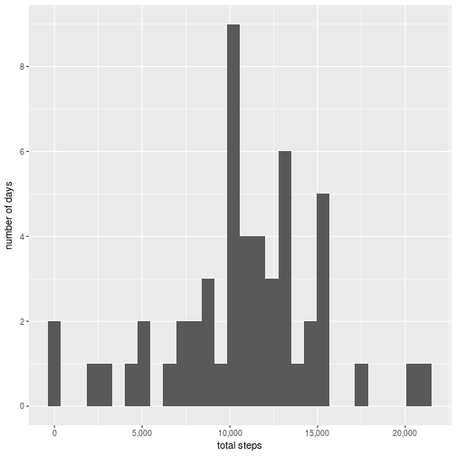
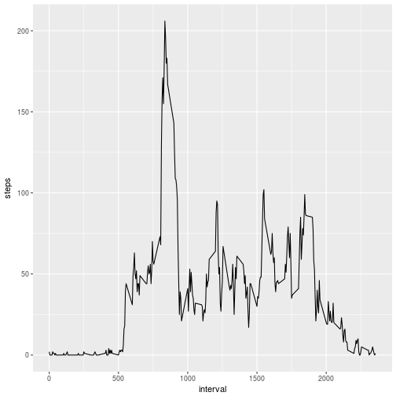
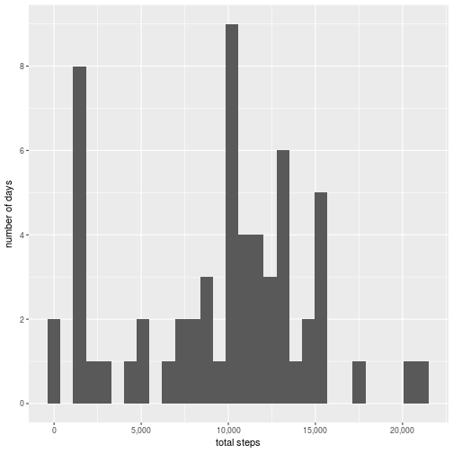
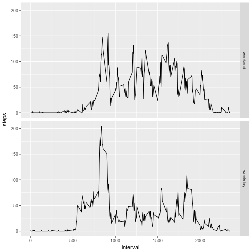

## Loading and preprocessing the data

```r
library(dplyr)

unzipped_file_directory <- tempdir()
activity_file_name <- "activity.csv"

unzip(zipfile = "activity.zip",
	files = activity_file_name,
	exdir = unzipped_file_directory)

activity_data_set <-
	read.csv(paste(unzipped_file_directory, activity_file_name, sep = "/")) %>%
	tbl_df()

unlink(unzipped_file_directory)
```


## What is mean total number of steps taken per day?

```r
library(ggplot2)
library(scales)

steps_per_day <-
	## When using 'sum()' funciton with 'na.rm = TRUE' argument there some days
	## with 0 steps occur which is not actually true. There is no information
	## about these days, hence they should be ignored. That's why filtering is
	## used instead of 'na.rm = TRUE' in the subsequent 'summarise()' function
	## with a view to get rid of multiple occurences of 0 steps values to
	## produce the correct histogram.
	filter(.data = activity_data_set, !is.na(steps)) %>%
	group_by(date) %>%
	summarise(steps = sum(steps))

ggplot(data = steps_per_day) +
	geom_histogram(mapping = aes(x = steps)) +
	scale_x_continuous(labels = comma) +
	scale_y_continuous(breaks = pretty_breaks()) +
	labs(x = "total steps", y = "number of days")
```



```r
mean(steps_per_day$steps) %>% round()
```

```
## [1] 10766
```

```r
median(steps_per_day$steps)
```

```
## [1] 10765
```


## What is the average daily activity pattern?

```r
mean_steps_per_interval <- group_by(.data = activity_data_set, interval) %>%
	summarise(steps = mean(steps, na.rm = TRUE) %>% round())

ggplot(data = mean_steps_per_interval) +
	geom_line(mapping = aes(x = interval, y = steps))
```



```r
max_steps_index <- which.max(mean_steps_per_interval$steps)
## 5-minute interval containing the biggest steps value
mean_steps_per_interval$interval[max_steps_index]
```

```
## [1] 835
```

```r
## The biggest steps value
mean_steps_per_interval$steps[max_steps_index]
```

```
## [1] 206
```


## Imputing missing values

```r
## Which variables contain NAs
sapply(activity_data_set, FUN = function(variable) anyNA(variable))
```

```
##    steps     date interval 
##     TRUE    FALSE    FALSE
```

```r
## How many NAs in the 'steps' variable
activity_data_set$steps[is.na(activity_data_set$steps)] %>% length()
```

```
## [1] 2304
```

```r
median_steps_per_interval <-
	filter(.data = activity_data_set, !is.na(steps)) %>%
	group_by(interval) %>%
	summarise(steps = median(steps))

## 'steps' variable NAs will be filled with the corresponding interval
## median values in the following for loop
activity_data_set_NAs_filled <- activity_data_set

for(i in seq_along(activity_data_set_NAs_filled$steps))
{
	if (is.na(activity_data_set_NAs_filled$steps[i]))
	{
		interval_index <-
			match(
				activity_data_set_NAs_filled$interval[i],
				table = median_steps_per_interval$interval
			)
		
		activity_data_set_NAs_filled$steps[i] <-
			median_steps_per_interval$steps[interval_index]
	}
}

steps_per_day_NAs_filled <-
	group_by(.data = activity_data_set_NAs_filled, date) %>%
	summarise(steps = sum(steps))

ggplot(data = steps_per_day_NAs_filled) +
	geom_histogram(mapping = aes(x = steps)) +
	scale_x_continuous(labels = comma) +
	scale_y_continuous(breaks = pretty_breaks()) +
	labs(x = "total steps", y = "number of days")
```



```r
mean(steps_per_day_NAs_filled$steps) %>% round()
```

```
## [1] 9504
```

```r
median(steps_per_day_NAs_filled$steps)
```

```
## [1] 10395
```


## Are there differences in activity patterns between weekdays and weekends?

```r
library(chron)

day_type <-
	factor(
		is.weekend(activity_data_set_NAs_filled$date),
		levels = c(TRUE, FALSE),
		labels = c("weekend", "weekday")
	)

activity_data_set_NAs_filled <-
	mutate(.data = activity_data_set_NAs_filled, day_type)

mean_steps_per_day_type <-
	group_by(.data = activity_data_set_NAs_filled, day_type, interval) %>%
	summarise(steps = mean(steps) %>% round())

ggplot(data = mean_steps_per_day_type) +
	geom_line(mapping = aes(x = interval, y = steps)) +
	facet_grid(facets = day_type ~ .)
```


